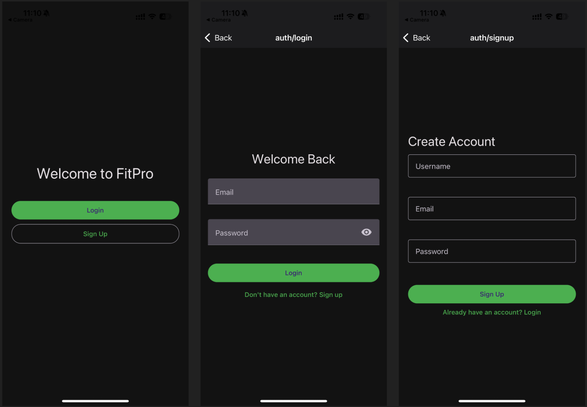
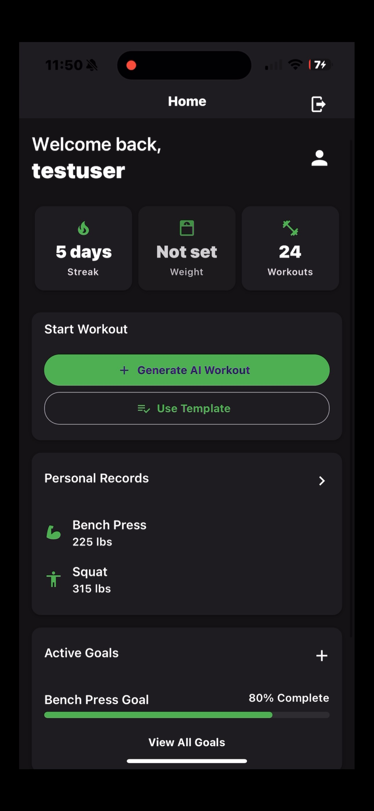
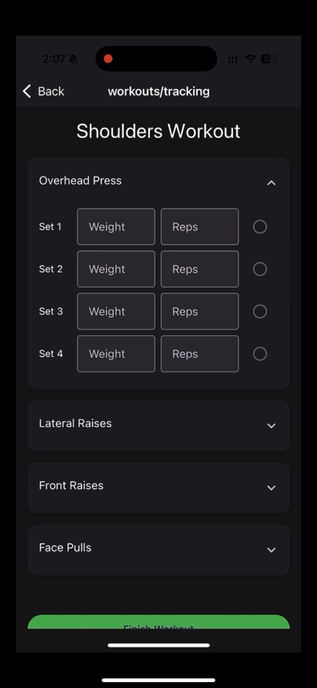
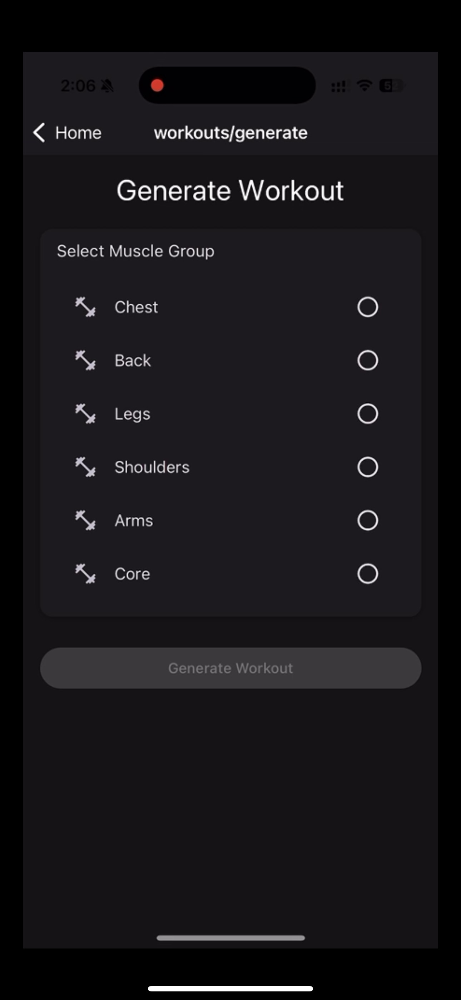
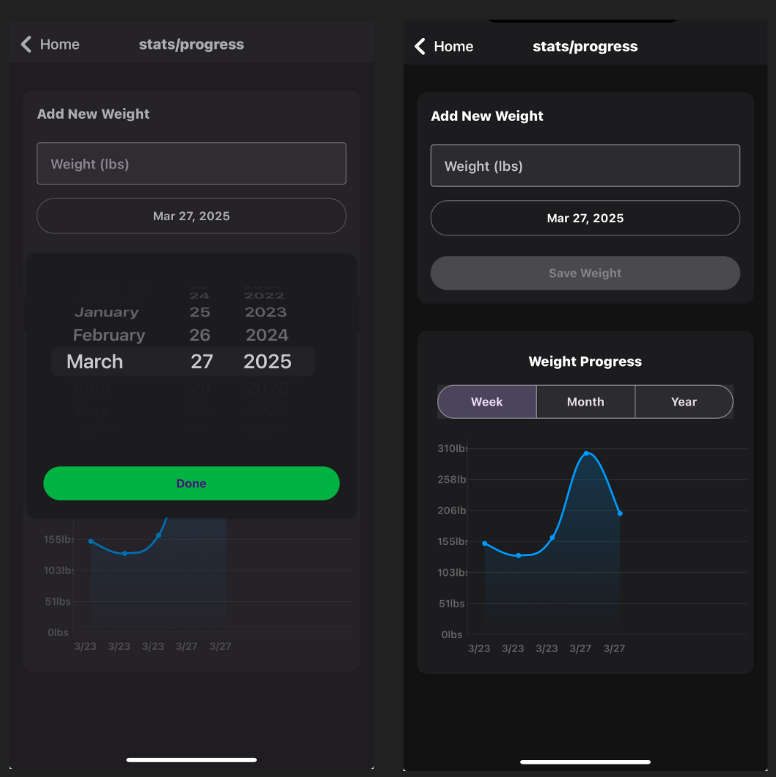
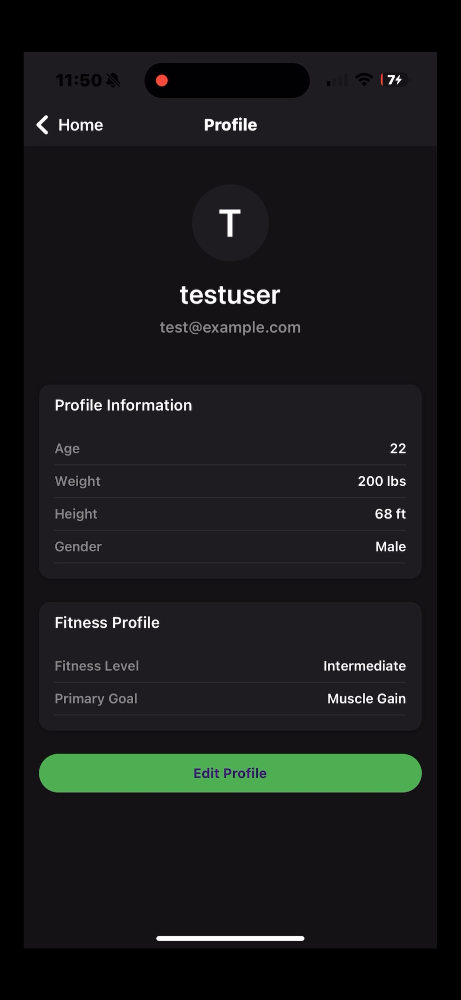
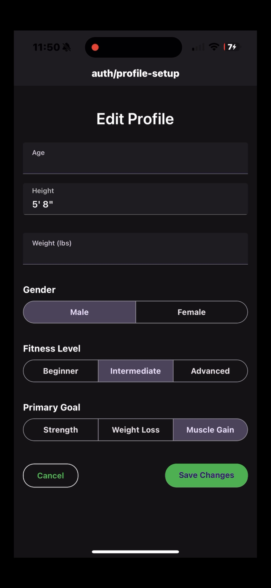

# FitPro - Fitness Progress Tracking Application

FitPro is a comprehensive fitness tracking application that helps users monitor their workout progress, track exercises, and visualize their fitness journey. The application features a modern mobile interface built with React Native and a robust backend service.

## 🚀 Features

- User authentication and profile management
- Workout tracking and exercise logging
- Progress visualization with interactive charts
- Exercise library with detailed instructions
- Real-time progress updates
- Cross-platform support (iOS and Android)

## 📸 Screenshots

### Authentication

*Secure login interface with email and password authentication*

### Dashboard

<br/>
*Main dashboard showing workout summary and quick actions*

### Workout Tracking


<br/>
*Detailed workout tracking interface with exercise logging*

### Progress Charts

*Interactive charts showing workout progress and statistics*

### Profile


<br/>
*User profile management with personal information and settings*

## 🛠️ Tech Stack

### Frontend
- React Native with Expo
- TypeScript
- React Navigation for routing
- React Native Paper for UI components
- React Native Chart Kit for data visualization
- Axios for API communication
- AsyncStorage for local data persistence

### Backend
- Java Spring Boot
- RESTful API architecture
- JWT Authentication
- AWS Elastic Beanstalk deployment
- PostgreSQL database

## 📱 Mobile App Features

- Clean and intuitive user interface
- Secure authentication system
- Exercise tracking and logging
- Progress charts and statistics
- Profile management
- Offline data persistence

## 🔧 Setup and Installation

### Prerequisites
- Node.js (v14 or higher)
- Java JDK 11 or higher
- Expo CLI
- Android Studio / Xcode (for mobile development)

### Frontend Setup
1. Navigate to the frontend directory:
   ```bash
   cd frontend
   ```

2. Install dependencies:
   ```bash
   npm install
   ```

3. Start the development server:
   ```bash
   npm start
   ```

### Backend Setup
1. Navigate to the backend directory:
   ```bash
   cd backend
   ```

2. Build the project:
   ```bash
   ./mvnw clean install
   ```

3. Run the application:
   ```bash
   ./mvnw spring-boot:run
   ```

## 🌐 API Documentation

The backend API provides the following main endpoints:

- Authentication:
  - POST /api/auth/register
  - POST /api/auth/login
  - GET /api/auth/profile

- Workouts:
  - GET /api/workouts
  - POST /api/workouts
  - GET /api/workouts/{id}
  - PUT /api/workouts/{id}
  - DELETE /api/workouts/{id}

- Exercises:
  - GET /api/exercises
  - POST /api/exercises
  - GET /api/exercises/{id}

## 🚀 Deployment

The application is deployed using:
- Frontend: Expo deployment
- Backend: AWS Elastic Beanstalk
- Database: AWS RDS (PostgreSQL)


## 👥 Authors

- Mohammed Saleh & Amr Mahmood

## 🙏 Acknowledgments

- React Native community
- Spring Boot team
- AWS Elastic Beanstalk documentation
- All contributors and supporters of the project
